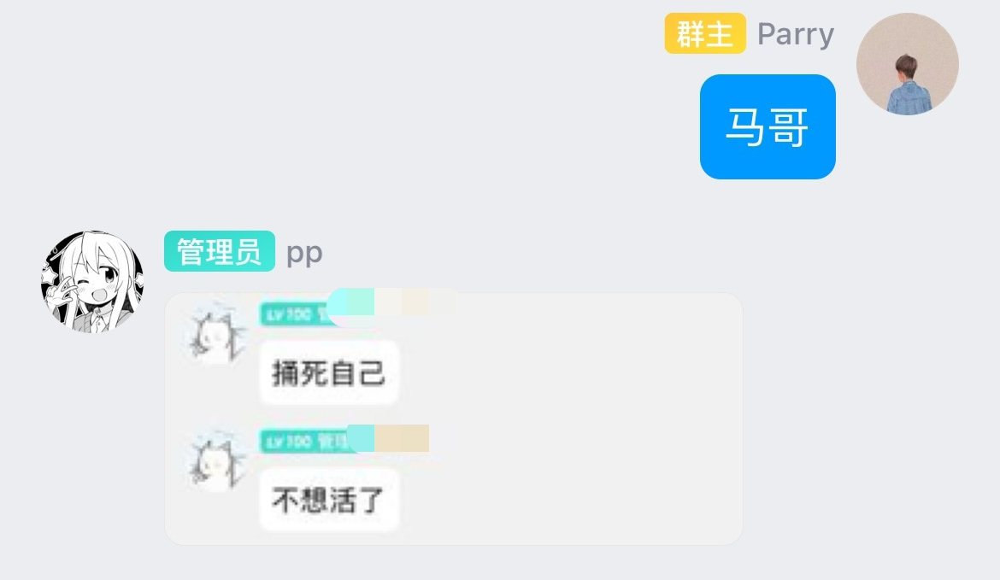
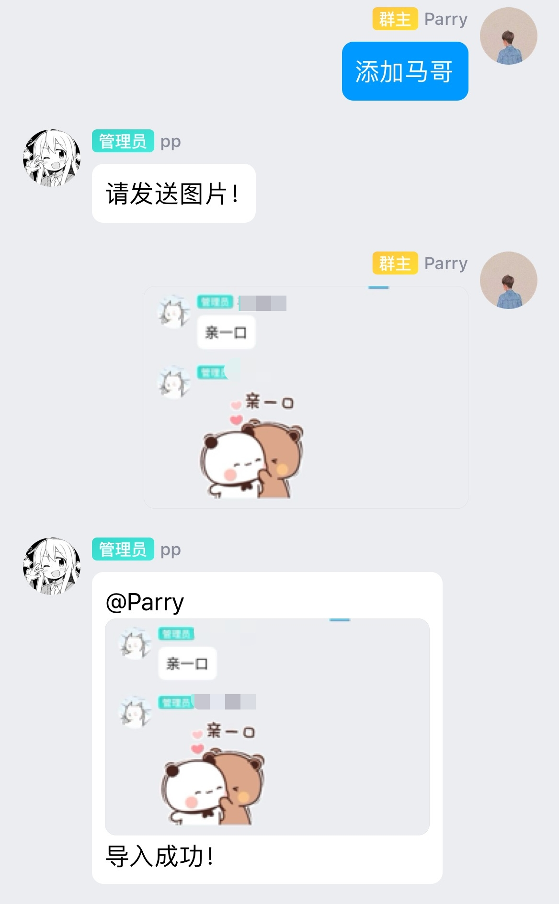

<div align="center">
  <a href="https://v2.nonebot.dev/store"></a>
  <br>
  <p></p>
</div>

<div align="center">

# nonebot-plugin-randpic

_✨ 一个发送指令就能让你的 bot 发出对应指令的图片的插件 ✨_


<a href="./LICENSE">
    
</a>
<a href="https://pypi.python.org/pypi/nonebot-plugin-randpic">
    
</a>


</div>

## 📖 介绍

这是由 [nonebot-plugin-capoo](https://github.com/HuParry/nonebot-plugin-capoo) 插件衍生而来的随机发送图片的插件，从使用上来看，这个插件远优于那个插件。

你可以很方便地直接通过在配置文件里设置好触发指令（支持多个触发指令）后，在群聊中发送对应指令，从而使 Bot 随机发送出你所存储的图片。

插件除了能随机发送图片，还能在群聊内直接通过指令存储图片，同时为了避免重复加入同一张图片，该插件添加了 md5 码检查。

随机发送图片是利用 sql 语句随机选择指令。

该插件的运行逻辑是：
- 自动在 Bot 所设文件夹下创建一个 `randpic` 文件夹；
- 在你预设指令（可以是多个）后，插件会检索指令，并在 `randpic` 目录下生成所有你预设命令作为名字的文件夹，同时生成一个 `data.db` 的数据库文件；
- 之后你可以通过 Bot 存储图片，也可以直接在 `<预设命令>` 文件夹下存储图片。

你可以在bot未启动期间任意修改图片文件夹内的所有内容，因为在启动bot后插件会自动做图片配置检查，因此你不用担心自己修改图片后会导致数据库与文件夹内容不同步。

**但是在启动bot后不建议修改、删除以及添加图片**，否则可能会造成一些未知bug。

不建议你存储过多图片（指几万张甚至更多），因为没做过存储大量图片的测试。

有任何问题可提 issue，看到会及时回复，目前功能比较简单，以后会慢慢扩充。

由于sqlite3库是同步数据库，日后将考虑更换成orm。

## 💿 安装

<details>
<summary>使用 nb-cli 安装</summary>
在 nonebot2 项目的根目录下打开命令行, 输入以下指令即可安装

    nb plugin install nonebot-plugin-randpic

</details>

<details>
<summary>使用包管理器安装</summary>
在 nonebot2 项目的插件目录下, 打开命令行, 根据你使用的包管理器, 输入相应的安装命令

<details>
<summary>pip</summary>

    pip install nonebot-plugin-randpic
</details>
<details>
<summary>pdm</summary>

    pdm add nonebot-plugin-randpic
</details>
<details>
<summary>poetry</summary>

    poetry add nonebot-plugin-randpic
</details>
<details>
<summary>conda</summary>

    conda install nonebot-plugin-randpic
</details>

打开 nonebot2 项目根目录下的 `pyproject.toml` 文件, 在 `[tool.nonebot]` 部分追加写入

    plugins = ["nonebot_plugin_capoo"]

</details>

## ⚙️ 配置

在 nonebot2 项目的`.env`文件中添加下表中的必填配置

|          配置项           | 必填 |    默认值   |                   说明                    |
|:----------------------:|:--:|:--------:|:---------------------------------------:|
|  randpic_command_list  | 否  | ["capoo"] |      预设的触发指令，默认是capoo，即capoo触发发送图片      |
| randpic_store_dir_path | 否  |     get_data_dir("nonebot_plugin_randpic")     | 图片存储的路径，用户自定义路径，不定义路径则由localstore插件定义路径 |

例如这样配置：
```
randpic_command_list=["capoo", "马哥"]
randpic_store_dir_path="data/randpic"
```

## 🎉 使用
### 指令表
| 指令 | 权限 | 需要@ | 范围 |        说明         |
|:-----:|:----:|:----:|:----:|:-----------------:|
| `<你设置的指令>` | 群员 | 否 | 群聊 |   随机发送一张对应指令的图片   |
| `添加<你设置的指令>` | 群管 | 否 | 群聊 | 让 bot 存储图片到对应文件夹下 |

### 效果图
#### `capoo` 指令


#### `添加capoo` 指令


#### `马哥` 指令


#### `添加马哥` 指令



## TODO
- [x] 指令触发 bot 发送图片
- [x] 在 QQ 上让 bot 存储对应指令的图片
- [x] 每次存储图片，判断图片是否已经存在，避免重复加入
- [ ] 指定某个序号的图片发送
- [X] 由该插件衍生成一个模板插件，即仅需修改参数就能发送别的图片