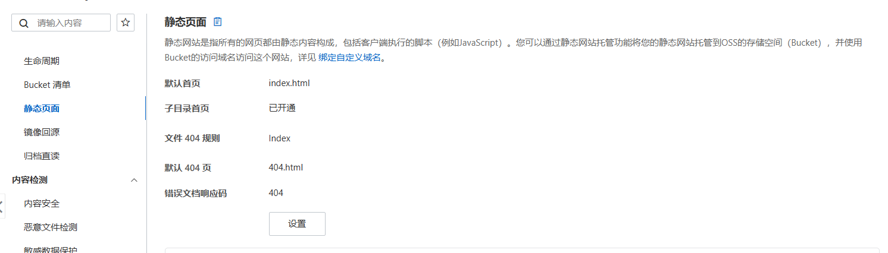
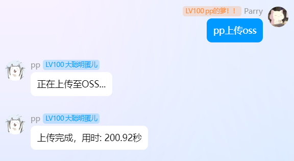
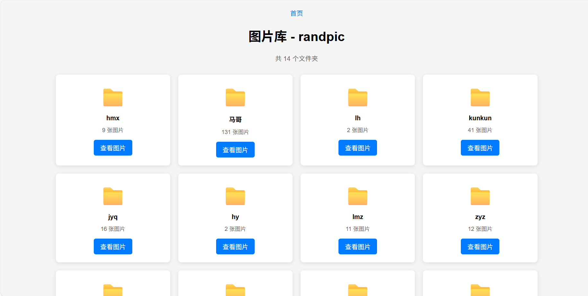

<div align="center">
  <a href="https://v2.nonebot.dev/store"></a>
  <br>
  <p></p>
</div>

<div align="center">

# nonebot-plugin-randpic

_✨ 一个发送指令就能让你的 bot 发出对应指令的图片的插件 ✨_


<a href="./LICENSE">
    
</a>
<a href="https://pypi.python.org/pypi/nonebot-plugin-randpic">
    
</a>


</div>

## 📖 介绍

这是由 [nonebot-plugin-capoo](https://github.com/HuParry/nonebot-plugin-capoo) 插件衍生而来的随机发送图片的插件，从使用上来看，这个插件远优于 [nonebot-plugin-capoo](https://github.com/HuParry/nonebot-plugin-capoo) 插件。

你可以很方便地直接通过在配置文件里设置好触发指令（支持多个触发指令）后，在群聊中发送对应指令，从而使 Bot 随机发送出你所存储的图片。

插件除了能随机发送图片，还能在群聊内直接通过指令存储图片，同时为了避免重复加入同一张图片，该插件添加了 md5 码检查。

随机发送图片是利用 sql 语句随机选择指令。

该插件的运行逻辑是：
- 自动在 Bot 所设路径下创建一个 `randpic` 文件夹；
- 在你预设指令（可以是多个）后，插件会检索指令，并在 `randpic` 目录下生成所有你预设命令作为名字的文件夹，同时在 `randpic/database` 目录下生成一个 `data.db` 的数据库文件；
- 之后你可以通过 Bot 存储图片，也可以直接在 `<预设命令>` 文件夹下存储图片。

例如你设置了其中一个触发指令为`capoo`，并且你设置了存储路径为`/data`，你可以自己直接给bot运行的服务器的`/data/randpic/img/capoo/`文件夹上传你想要的图片，并且你在群聊中通过指令让bot存储的图片也会存储在`/data/randpic/img/capoo/`里。

你可以在bot未启动期间任意修改图片文件夹内的所有内容，因为在启动bot后插件会自动做图片配置检查，因此你不用担心自己修改图片后会导致数据库与文件夹内容不同步。

**图片大于1MB的将压缩至1MB以内再储存，因此有高清图片保存需求的慎用！！！**

**在启动bot后不建议修改、删除以及添加图片**，否则可能会造成一些未知bug。

不建议你存储过多图片（指几万张甚至更多），因为没做过存储大量图片的测试。


<details>
<summary> v1.0.0版本新增 </summary>

图片太多太杂，上服务器查看图片太过麻烦，你是不是想通过网页直接看到目前已经存储了哪些图片？自v1.0.0版本后，本插件可以配置阿里云OSS对象存储，如果你自己手里有已备案的域名，可以用来搭建静态网页，方便 自己/群友 点击链接查看图片列表。

如何配置阿里云OSS对象存储？请自行百度搜索步骤。

想要在插件里启用阿里云OSS功能，你需要准备好以下数据，便于之后配置到.env文件中：

- randpic_endpoint：自定义域名。你的OSS bucket捆绑的哪个域名就填哪个。注意尾部不加`/`；
- randpic_bucket：阿里云OSS存储空间的名称；
- randpic_region：bucket所在的地域，例如 `cn-beijing`，各个地域ID可见[OSS地域和访问域名](https://help.aliyun.com/zh/oss/regions-and-endpoints#e583bfe5e6sme)；
- randpic_oss_access_key_id、randpic_oss_access_key_secret：阿里云用户的AccessKey ID和AccessKey Secret。

以上的配置项不配齐的话静态网页功能将不生效。

bucket的访问权限至少要设置为公共读，否则通过域名也无法访问到图片。为了能网页访问，你需要给bucket配置好你自己的域名。

另外还需要如下图这样设置bucket的静态页面，跟下图一样地配置即可：



注意：静态页面要通过 `上传oss` 指令后才会构建页面，但是每次通过 `添加` 指令添加图片时，无需重复发送 `上传oss` 指令，图片会自动上传。

若有不明白的地方可以尝试联系我。


</details>


## 💿 安装

<details>
<summary>使用 nb-cli 安装</summary>
在 nonebot2 项目的根目录下打开命令行, 输入以下指令即可安装

    nb plugin install nonebot-plugin-randpic

</details>

<details>
<summary>使用包管理器安装</summary>
在 nonebot2 项目的插件目录下, 打开命令行, 根据你使用的包管理器, 输入相应的安装命令

<details>
<summary>pip</summary>

    pip install nonebot-plugin-randpic
</details>
<details>
<summary>pdm</summary>

    pdm add nonebot-plugin-randpic
</details>
<details>
<summary>poetry</summary>

    poetry add nonebot-plugin-randpic
</details>
<details>
<summary>conda</summary>

    conda install nonebot-plugin-randpic
</details>

打开 nonebot2 项目根目录下的 `pyproject.toml` 文件, 在 `[tool.nonebot]` 部分追加写入

    plugins = ["nonebot_plugin_capoo"]

</details>

## ⚙️ 配置

在 nonebot2 项目的`.env`文件中添加下表中的必填配置

|          配置项           | 必填 |                  默认值                   |                   说明                    |
|:----------------------:|:--:|:--------------------------------------:|:---------------------------------------:|
|  randpic_command_list  | 否  |               ["capoo"]                |      预设的触发指令，默认是capoo，即capoo触发发送图片      |
| randpic_store_dir_path | 否  | get_data_dir("nonebot_plugin_randpic") | 图片存储的路径，用户自定义路径，不定义路径则由localstore插件定义路径 |
|  randpic_banner_group  | 否  |                   []                   |               不触发发图功能的群聊                |
|  randpic_endpoint  | 否  |                  None                  |      填写自定义域名，域名尾部不用加/ （后续实现相关功能）      |
|  randpic_bucket  | 否  |                  None                  |      阿里云OSS对象存储空间名称(bucket)      |
| randpic_region | 否 | None | 阿里云OSS对象存储bucket所在地域 |
| randpic_oss_access_key_id | 否 | None | 阿里云用户AccessKey ID |
| randpic_oss_access_key_secret | 否 | None | 阿里云用户AccessKey Secret |

例如这样配置：
```
randpic_command_list=["capoo", "马哥"]
randpic_store_dir_path="data/randpic"
randpic_banner_group=[574145050]
randpic_endpoint="https://xxx.huparry.cn"
randpic_bucket="randpic"
randpic_region="cn-beijing"
randpic_oss_access_key_id="xxxxxxxxxxxxxxxxxxxxxx"
randpic_oss_access_key_secret="xxxxxxxxxxxxxxxxxxxxx"
```


## 🎉 使用

### 指令表
|      指令      | 权限 | 需要@ | 范围 |              说明               |
|:------------:|:----:|:----:|:----:|:-----------------------------:|
|  `<你设置的指令>`  | 群员 | 否 | 群聊 |         随机发送一张对应指令的图片         |
| `添加<你设置的指令>` | 群管 | 否 | 群聊 |       让 bot 存储图片到对应文件夹下       |
|   `上传oss`    | 群管 | 否 | 群聊 | 若配置了阿里云OSS，则通过该指令生成静态网页上传至OSS |

### 效果图
#### `capoo` 指令


#### `添加capoo` 指令


#### `马哥` 指令


#### `添加马哥` 指令


#### `上传oss` 指令


#### 静态页面网页效果（仅在正确配置OSS情况下生效）


## TODO
- [x] 指令触发 bot 发送图片
- [x] 在 QQ 上让 bot 存储对应指令的图片
- [x] 每次存储图片，判断图片是否已经存在，避免重复加入
- [X] 由capoo插件衍生成一个模板插件，即仅需修改参数就能发送别的图片
- [X] 添加图片压缩功能，避免图片文件夹空间过大
- [X] 以阿里云OSS对象存储搭建静态网页，便于浏览器查看图片
- [ ] 完善权限管理机制，采用更详细的权限管理，避免插件滥用
- [ ] 添加智能识图选项（调用api），避免添加违禁图导致被风控
